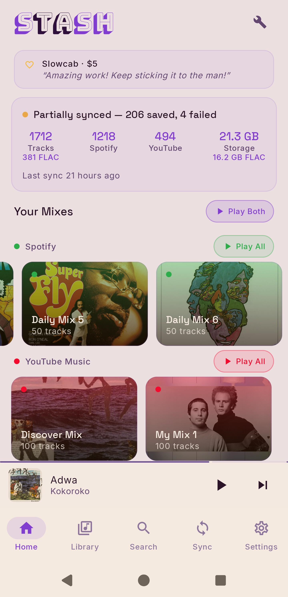
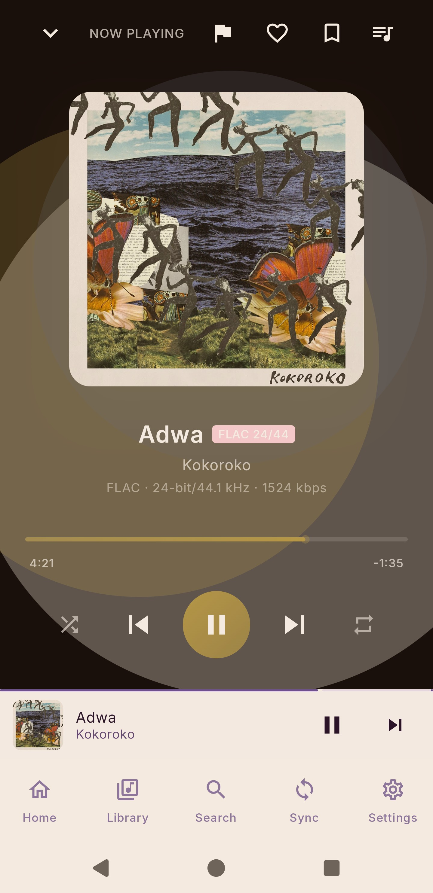

# Stash

> **Your Spotify + YouTube Music library, on your phone, in FLAC.**

[](LICENSE)
[](#requirements)
[](https://github.com/rawnaldclark/Stash/releases)
[](https://discord.gg/tbBSMd6dR)

Stash mirrors your Spotify and YouTube Music libraries to your Android phone. You connect each service once, pick the playlists and mixes you actually want, and Stash either downloads them as real FLAC files for offline playback or surfaces them as a streaming index so you can play any track without filling up your storage. Same library, two modes, one tap to switch.

There's no Stash account. No subscription. No ads. No analytics. Your credentials live on your phone, encrypted, and the only network traffic Stash makes is to Spotify and YouTube themselves.

<p align="center">
  
  
</p>

---

## Online vs Offline

Stash has two modes. They decide what a sync actually does.

**Offline mode** is the default and the one most people want. Sync downloads each track as a FLAC file (or the closest lossless source available) and stores it on your phone. Once a track is on disk you can play it forever with no connection. It costs storage but no recurring data.

**Online mode** is for people who don't want the storage hit. Sync builds a local index of your library — every track from every synced playlist is visible and playable — but nothing lands on disk. Playback streams in FLAC or via YouTube on demand. Almost no storage, but you need a connection to play.

The Sync tab has a toggle right above the sync button so you can flip modes without leaving the screen. Most people pick one and forget about it.

---

## Features

### Library

- **Spotify + YouTube Music in one unified library** — liked songs, playlists, daily mixes, every Spotify mix worth syncing
- **Bulletproof matching** — finds the right version of a track 99% of the time
- **Custom playlists** you build inside Stash, including ones that mix downloaded and streamed tracks
- **Last.fm scrobbling**, optional, off by default
- **Wrong-match flag** — if Stash picked the wrong version, tap once from Now Playing and it queues a re-search
- **Failed Downloads viewer** — when a track really can't be matched or processed, it shows up here with one-tap retry, not as a silent miss

### Sync

- Per-playlist toggles for everything either service exposes: Daily Mixes 1–6, Release Radar, Discover Weekly, Daylist, Time Capsule, Repeat Rewind, On Repeat, Replay, Liked Songs. Don't want Daily Mix 3? Turn it off.
- Refresh or Accumulate per source — replace the mix each sync, or stack new tracks on top of the old ones
- Parallel downloads, eight at a time, running as a foreground service so the sync actually finishes with the screen off
- Daily auto-sync on a schedule of your choosing, with a battery-aware "only on Wi-Fi" option
- Auth-expired banner that catches a stale cookie before the sync wastes its time

### Playback

- 5-band equalizer with presets, bass boost, virtualizer
- Synced lyrics, pulled from LRCLIB and scrolled with the track
- High-res album art, embedded into the file so third-party players see it
- Background playback that actually keeps playing when the phone is locked

### Privacy

- No Stash servers. No accounts. No analytics. No third-party crash reporters.
- Cookies stored on-device, encrypted with AES-256-GCM via Google's [Tink](https://developers.google.com/tink)
- The only network requests Stash makes are to Spotify and YouTube directly
- GPL-3.0, every line of code is open source

---

## Install

Three paths. Pick whichever you'd actually use.

### Direct APK

1. On your Android device, open the [Releases page](https://github.com/rawnaldclark/Stash/releases).
2. Download the latest `Stash-v*.apk`.
3. Open it. If Android warns about installs from unknown sources, allow it for the browser and try again.
4. Tap **Install**.

### Obtainium (auto-updates)

[Obtainium](https://obtainium.imranr.dev/) tracks GitHub Releases and notifies you when a new version ships. Add `https://github.com/rawnaldclark/Stash` and you're done.

### Build from source

```bash
git clone https://github.com/rawnaldclark/Stash.git
cd Stash
./gradlew assembleDebug
# APK lands in app/build/outputs/apk/debug/
```

You'll need Android Studio Hedgehog (2023.1.1) or later, JDK 17, and Android SDK 35.

### Requirements

- Android **8.0 (API 26)** or later
- About **9–15 GB** of free storage for a medium library in Offline mode (scales with how much you sync). Online mode needs almost nothing.
- A Spotify and/or YouTube Music account

---

## First-time setup

Stash doesn't use Spotify's or YouTube's official APIs, because the official APIs don't let third-party apps do what Stash does. It uses your existing login cookies instead. This sounds sketchier than it is: cookies live only on your device, encrypted with AES-256-GCM, and the only place they ever get sent is back to Spotify or YouTube themselves. The setup is a couple of minutes per service.

<details>
<summary><b>🎵 Connect Spotify</b></summary>

### Option A — Sign in inside the app (easiest)

1. Open Stash → **Settings** → tap **Spotify** under Accounts → tap **Connect**.
2. A Spotify login page opens inside the app.
3. Sign in with your email/password, Google, Apple, or Facebook — whatever you normally use.
4. Stash extracts the cookie automatically once login succeeds. Done.

If the in-app login fails for any reason, fall back to Option B.

### Option B — Paste the cookie manually

1. On a computer, open **[https://open.spotify.com](https://open.spotify.com)** and make sure you're logged in.
2. Press **F12** to open Developer Tools.
3. Find the **Application** tab at the top of DevTools (it's **Storage** on Firefox). Click the `>>` arrows if you don't see it.
4. In the left sidebar, expand **Cookies** → click `https://open.spotify.com`.
5. Find the cookie named **`sp_dc`**.
6. Double-click the value and copy it.
7. On your phone, open Stash → **Settings** → tap **Spotify** → **Connect** → **"Paste cookie"** in the top-right.
8. Paste the value and tap **Connect**.

> **Tip:** cookies from incognito / private windows sometimes fail to sync. If you hit weird errors, use a regular browser window.

> **Why a cookie?** Spotify's mobile login API doesn't allow third-party apps. The cookie approach authenticates Stash the same way your browser session does. The cookie is session-scoped and can be revoked by logging out of Spotify on the web.

</details>

<details>
<summary><b>📺 Connect YouTube Music</b></summary>

1. On a computer, open **[https://music.youtube.com](https://music.youtube.com)** and make sure you're logged in.
2. Press **F12** to open Developer Tools.
3. Click the **Network** tab.
4. Refresh the page (F5).
5. In the filter box, type **`browse`** and press Enter.
6. Click any request in the list (they should all start with `browse`).
7. Scroll the right panel until you find **Request Headers**.
8. Find the line starting with **`cookie:`** and copy the entire value after `cookie:`. It's long, with a lot of `=` and `;` characters.
9. On your phone, open Stash → **Settings** → tap **YouTube Music** under Accounts → **Connect**.
10. Paste the full cookie string and tap **Connect**.

Stash will start pulling your YouTube Music daily mixes, discover mix, replay mix, and liked music.

> **Tip:** same incognito caveat as Spotify — use a regular browser window.

> **Why the whole cookie header?** YouTube authenticates with multiple cookies together (`SAPISID`, `__Secure-3PAPISID`, `LOGIN_INFO`). Grabbing all of them at once is easier than finding each one individually.

</details>

### After setup

Open the Sync tab. Before you tap Sync Now, expand the **Spotify Sync Preferences** card and pick the playlists and mixes you actually want — each playlist has its own toggle. For mixes, decide between **Refresh** mode (each sync replaces the mix's contents, cleaning up old tracks) and **Accumulate** mode (each sync stacks new tracks on top of what's there). Refresh is the default and is probably what you want.

The first sync is the slow one — a thousand-song library takes about an hour in Offline mode because every track has to download. After that, scheduled syncs just pick up whatever's new and run quietly in the background.

### When background sync stops working

Some Android phones — looking at you, Samsung, Xiaomi, OnePlus, Huawei — kill background processes aggressively to save battery. If your sync fails partway through with a foreground-service error, the fix is one toggle:

1. Phone Settings → Apps → Stash → **Battery**
2. Set to **Unrestricted**

You only need to do this once. If that's not enough on your specific device, [dontkillmyapp.com](https://dontkillmyapp.com/) has manufacturer-specific instructions.

---

## Why Stash isn't on the Play Store

Stash downloads audio from YouTube and Spotify, which violates both services' Terms of Service. Google Play policy bans apps that facilitate unauthorized downloads. Every project in this space — NewPipe, YTDLnis, SpotTube, InnerTune — is distributed outside the Play Store for the same reason.

That isn't a workaround. It's a principled choice: open-source tools that give users control over their own libraries don't belong in a gatekept store that could revoke them on a whim. GitHub Releases (and F-Droid, when we're ready) are the right home for Stash.

---

## Community

Bug reports and feature requests through [GitHub Issues](https://github.com/rawnaldclark/Stash/issues). For everything else — questions, requests, "is this thing on" — the [Stash Discord](https://discord.gg/tbBSMd6dR) is the place. Active dev there, fast answers.

---

## Contributing

Pull requests welcome. For anything substantial, please open an issue first so we can talk through the change before you sink time into a PR.

Stash is GPL-3.0. You can use, copy, modify, and redistribute it freely. If you distribute a modified version, you have to release your changes under GPL-3.0 too.

---

## Support Stash

Stash is free, open source, and has no ads or telemetry. If it replaced a subscription for you and you want to throw a few bucks at the project:

<a href="https://ko-fi.com/rawnald"></a>

You can also [sponsor on GitHub](https://github.com/sponsors/rawnaldclark) for recurring support.

A star, a bug report, or telling a friend helps just as much. Thanks.

---

## Privacy and Security

If you find a security issue, please use the disclosure process in [SECURITY.md](SECURITY.md).

---

## Legal disclaimer

Stash is an independent, unofficial project. It is **not affiliated with, endorsed by, or sponsored by Spotify AB, YouTube LLC, Google LLC, or Alphabet Inc.** All trademarks belong to their respective owners.

Stash is provided **for personal use only** — a tool for managing your own library. You're responsible for complying with the Terms of Service of any music service you use Stash with. Downloading copyrighted content without a license may be illegal in your jurisdiction. The Stash project accepts no responsibility for misuse.

---

## Acknowledgments

Stash builds on top of several open-source projects:

- **[yt-dlp](https://github.com/yt-dlp/yt-dlp)** — the YouTube extraction backbone
- **[youtubedl-android](https://github.com/JunkFood02/youtubedl-android)** — yt-dlp's Android bindings
- **[QuickJS-NG](https://github.com/quickjs-ng/quickjs)** — lightweight JS engine for YouTube's signature challenges
- **[Media3 / ExoPlayer](https://github.com/androidx/media)** — audio playback
- **[ytmusicapi](https://github.com/sigma67/ytmusicapi)** — YouTube Music API reverse-engineering reference
- **[Bungee Shade](https://fonts.google.com/specimen/Bungee+Shade)** — the wordmark font, by David Jonathan Ross (SIL OFL)
- **Discord logo** — Simple Icons (CC0)

---

## License

Copyright © 2026 Rawnald Clark

Stash is free software: you can redistribute it and/or modify it under the terms of the [GNU General Public License](LICENSE), either version 3 of the License, or (at your option) any later version.

This program is distributed in the hope that it will be useful, but **WITHOUT ANY WARRANTY**; without even the implied warranty of MERCHANTABILITY or FITNESS FOR A PARTICULAR PURPOSE. See the LICENSE file for the full text.
